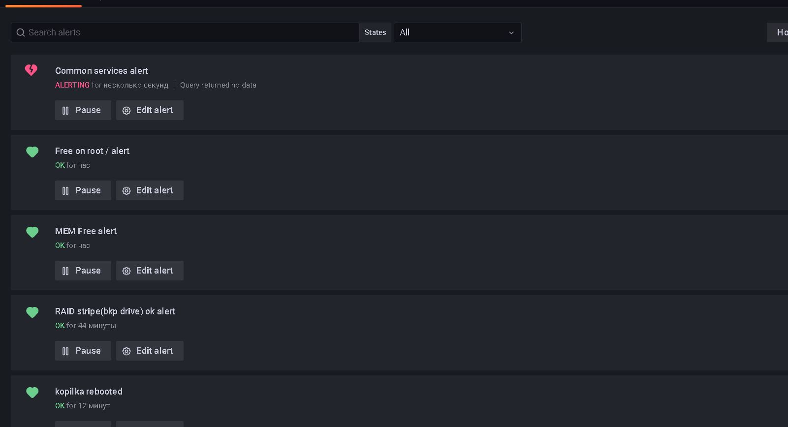

# Домашнее задание к занятию "10.03. Grafana"

## Задание повышенной сложности

**В части задания 1** не используйте директорию [help](./help) для сборки проекта, самостоятельно разверните grafana, где в 
роли источника данных будет выступать prometheus, а сборщиком данных node-exporter:
- grafana
- prometheus-server
- prometheus node-exporter

За дополнительными материалами, вы можете обратиться в официальную документацию grafana и prometheus.

В решении к домашнему заданию приведите также все конфигурации/скрипты/манифесты, которые вы 
использовали в процессе решения задания.

Ответ:  
* Установил локально на домашнее хранилище без докера, т.к. не вижу большого смысла в докере и после переезда со старого железа под win, уже как год, нужно настроить мониторинг. Подходящий случай.
* Хотя тут идея - инфраструктура как код.

**В части задания 3** вы должны самостоятельно завести удобный для вас канал нотификации, например Telegram или Email
и отправить туда тестовые события.

В решении приведите скриншоты тестовых событий из каналов нотификаций.

## Обязательные задания

### Задание 1
Используя директорию [help](./help) внутри данного домашнего задания - запустите связку prometheus-grafana.

Зайдите в веб-интерфейс графана, используя авторизационные данные, указанные в манифесте docker-compose.

Подключите поднятый вами prometheus как источник данных.

Решение домашнего задания - скриншот веб-интерфейса grafana со списком подключенных Datasource.
Ответ:  

## Задание 2
Изучите самостоятельно ресурсы:
- [promql-for-humans](https://timber.io/blog/promql-for-humans/#cpu-usage-by-instance)
- [understanding prometheus cpu metrics](https://www.robustperception.io/understanding-machine-cpu-usage)

Создайте Dashboard и в ней создайте следующие Panels:
Ответы со здвездочкой  
- Утилизация CPU для nodeexporter (в процентах, 100-idle)
  * avg by (instance) (rate(node_cpu_seconds_total{job="node",mode="idle"}[1m])) * 100
- CPULA 1/5/15
  * 100 - (avg by (instance) (rate(node_cpu_seconds_total{job="node",mode="idle"}[1m])) * 100)
  * 100 - (avg by (instance) (rate(node_cpu_seconds_total{job="node",mode="idle"}[5])) * 100)
  * 100 - (avg by (instance) (rate(node_cpu_seconds_total{job="node",mode="idle"}[15m])) * 100)
- Количество свободной оперативной памяти
  * node_memory_MemFree_bytes
- Количество места на файловой системе
  * node_filesystem_free_bytes{device="/dev/sde2",fstype="ext4",mountpoint="/"}

Для решения данного ДЗ приведите promql запросы для выдачи этих метрик, а также скриншот получившейся Dashboard.

Ответ:  

## Задание 3
Создайте для каждой Dashboard подходящее правило alert (можно обратиться к первой лекции в блоке "Мониторинг").

Для решения ДЗ - приведите скриншот вашей итоговой Dashboard.  
Ответ:   
* Буду пилить уведомления для своего домашнего боя) уже не в рамках ДЗ, а для себя, пока без алерта по процу, что бы не зафлудить себя. Настрою алерт проца позже при пробитии порога, в течении часа.
* Я не понял одного, почему в датасурсах на фриспейс диска есть только /? Хотя видно что есть диски все мои в /dev/sd*
Планирую измерять диск не только системный а бэкап и диск хранилища, потом еще диск видеорегистратора тоже, как только верну его
  * Ранее уже был знаком с графаной, только не использовал бота и прометеус, нацелил дата сурс на бд мускул и скриптами клал метрики с таймштампом в таблицы... Неужели придется опять так свободное место измерять?
  
  
  

    
  
## Задание 4
Сохраните ваш Dashboard.

Для этого перейдите в настройки Dashboard, выберите в боковом меню "JSON MODEL".

Далее скопируйте отображаемое json-содержимое в отдельный файл и сохраните его.

В решении задания - приведите листинг этого файла.

Ответ:  
<a href='dash.json'>dash.json</a>
---

### Как оформить ДЗ?

Выполненное домашнее задание пришлите ссылкой на .md-файл в вашем репозитории.

---
