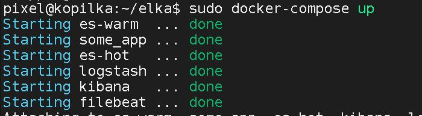
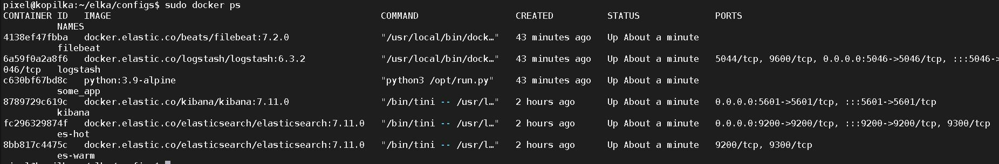
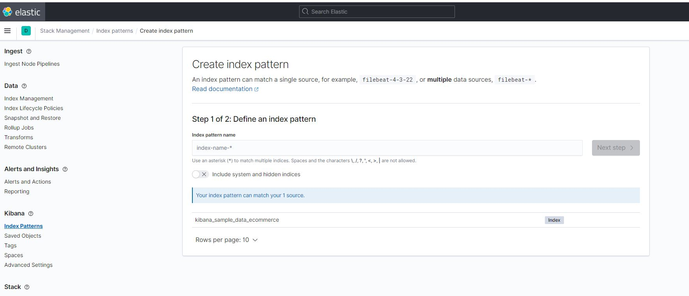
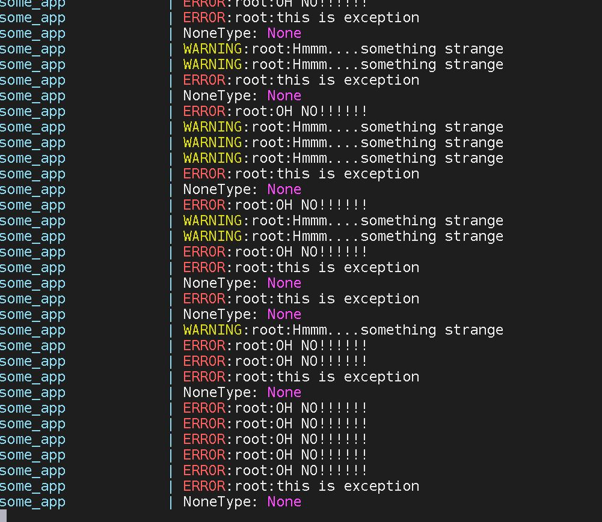

# Домашнее задание к занятию "10.04. ELK"

## Дополнительные ссылки

При выполнении задания пользуйтесь вспомогательными ресурсами:

- [поднимаем elk в докер](https://www.elastic.co/guide/en/elastic-stack-get-started/current/get-started-docker.html)
- [поднимаем elk в докер с filebeat и докер логами](https://www.sarulabs.com/post/5/2019-08-12/sending-docker-logs-to-elasticsearch-and-kibana-with-filebeat.html)
- [конфигурируем logstash](https://www.elastic.co/guide/en/logstash/current/configuration.html)
- [плагины filter для logstash](https://www.elastic.co/guide/en/logstash/current/filter-plugins.html)
- [конфигурируем filebeat](https://www.elastic.co/guide/en/beats/libbeat/5.3/config-file-format.html)
- [привязываем индексы из elastic в kibana](https://www.elastic.co/guide/en/kibana/current/index-patterns.html)
- [как просматривать логи в kibana](https://www.elastic.co/guide/en/kibana/current/discover.html)
- [решение ошибки increase vm.max_map_count elasticsearch](https://stackoverflow.com/questions/42889241/how-to-increase-vm-max-map-count)

В процессе выполнения задания могут возникнуть также не указанные тут проблемы в зависимости от системы.

Используйте output stdout filebeat/kibana и api elasticsearch для изучения корня проблемы и ее устранения.

## Задание повышенной сложности

Не используйте директорию [help](./help) при выполнении домашнего задания.
	Мне и с этим сложно было. Почему то опция :Z в маунтах уводила в ошибку весь маунт.
	написано в интернетах:
	 option tells Docker that the volume content will be shared between containers
	 посмотрим что будет
## Задание 1

Вам необходимо поднять в докере:
- elasticsearch(hot и warm ноды)
- logstash
- kibana
- filebeat

	
	
и связать их между собой.

Logstash следует сконфигурировать для приёма по tcp json сообщений.

Filebeat следует сконфигурировать для отправки логов docker вашей системы в logstash.

В директории [help](./help) находится манифест docker-compose и конфигурации filebeat/logstash для быстрого 
выполнения данного задания.

Результатом выполнения данного задания должны быть:
- скриншот `docker ps` через 5 минут после старта всех контейнеров (их должно быть 5)
	
- скриншот интерфейса kibana
	Смутило что ресурс Эластика
	
- docker-compose манифест (если вы не использовали директорию help)
- ваши yml конфигурации для стека (если вы не использовали директорию help)

	Использовал директорию. Но пришлось подправить yml filebeat, что бы пускался в той же сети что и другие контейнеры.
	(yml кусок либо туда, либо туда :) 
	output.logstash:
        hosts: ["172.23.0.4:5044", "172.23.0.5:5044"]
	)
## Задание 2

Перейдите в меню [создания index-patterns  в kibana](http://localhost:5601/app/management/kibana/indexPatterns/create)
и создайте несколько index-patterns из имеющихся.

Перейдите в меню просмотра логов в kibana (Discover) и самостоятельно изучите как отображаются логи и как производить 
поиск по логам.

В манифесте директории help также приведенно dummy приложение, которое генерирует рандомные события в stdout контейнера.
ага сыпит:

Данные логи должны порождать индекс logstash-* в elasticsearch. Если данного индекса нет - воспользуйтесь советами 
и источниками из раздела "Дополнительные ссылки" данного ДЗ.

	
	В логе евентов контейнера(/var/lib/docker/containers/*/*.log) logstash увидел строки^
	Но почему-то файл евентов настолько распух, что в прошлые выходные, моя копилка фоток просто встала по out of space.(приятно порадовало то, что смог отработать телеграм-бот+графана+прометей хоть и не по всем событиям, спасибо за курс :) )
	Сейчас за несколько минут распух до 3гб - и я все прервал. 
	Возможно все так, потому что файлбит смотрит пути:
	/var/lib/docker/containers/*/*.log
	а это приводит к заLOOPливанию записей - случилось событие - его отловили - это тоже событитие - и опять по кругу...
	
	индекс logstash- не появлися, пока не понял куда копать... получается логсташ не передеает в эластик...
	манускрпты пока не переварил, сдаю что есть. Може будет коментарий такой, что наведет меня на фикс.
---

### Как оформить ДЗ?

Выполненное домашнее задание пришлите ссылкой на .md-файл в вашем репозитории.

---

 
